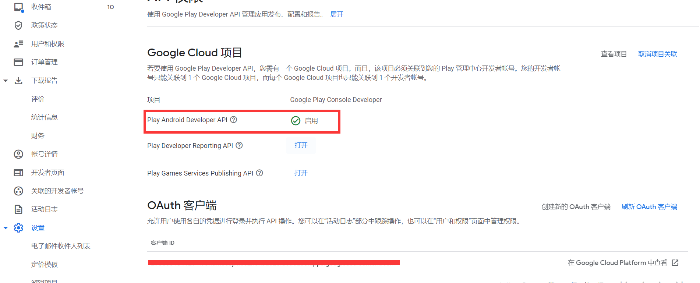

# Google Play上架

## 前期准备
- 开发者账号注册缴费25美元并且进行认证,开通谷歌支付的话须填写收款信息。
- AAB文件格式的安装包（注：安装包大于150M，要采用谷歌的分包机制。参考：<https://developer.android.google.cn/guide/playcore/asset-delivery?hl=zh_cn>）
- 签名秘钥文件
- 图片素材
  + PNG 或 JPEG 格式，大小不得超过 1 MB，尺寸为 512 x 512 像素的图标
  + PNG 或 JPEG 格式，大小不得超过 1 MB，尺寸为 1024 x 500 像素的置顶大图
  + 2 到 8 张PNG 或 JPEG 格式，每张的大小不得超过 8 MB，宽高比为 16:9 或 9:16，各条边的尺寸介于 320 像素和 3840 像素之间
    * 手机屏幕截图、7 英寸平板电脑屏幕截图、10 英寸平板电脑屏幕截图都需要按照上述标准
- 上架市场需要的app资料（例如：APP名称、简介、分类、联系方式、隐私协议网页、语言翻译、分级等等）
## 提审
1. 创建app
   - 使用已经注册完成的 Google play 开发者账号登录[Google Play Console][1]，应用名称、默认语言、应用或游戏、免费或付费根据证实情况填写。
   
    [1]:<https://play.google.com/console/developers>
    
2. 开始
3. 开始
4. 开始
5. 开始
6. 开始