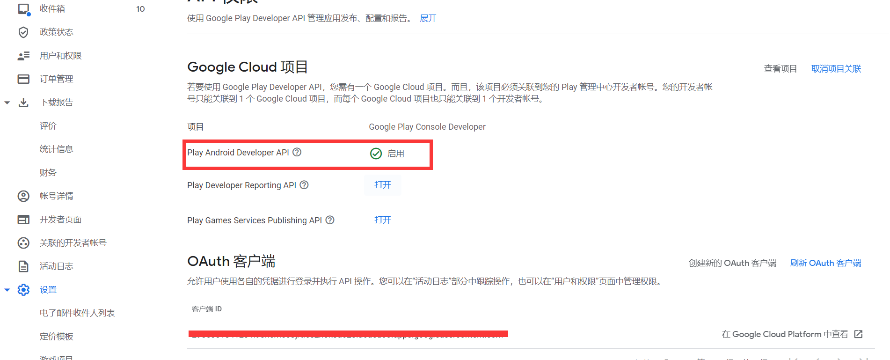
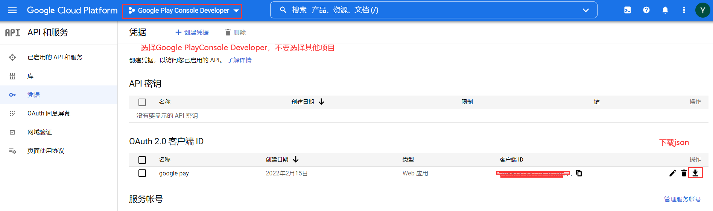
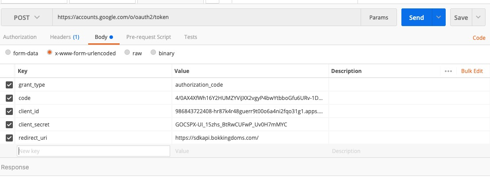
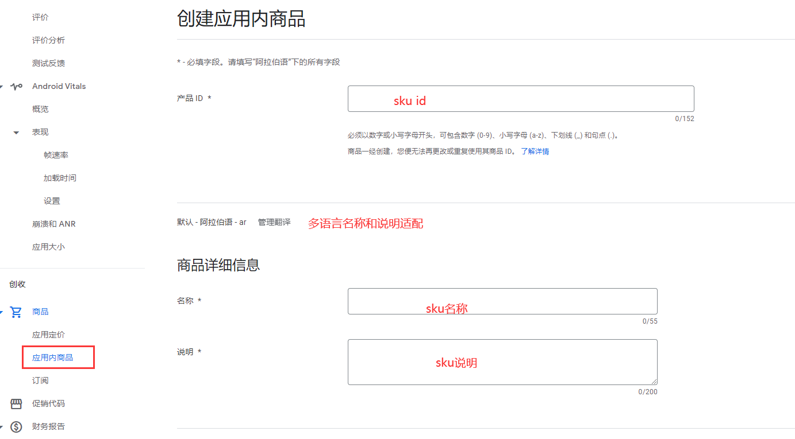
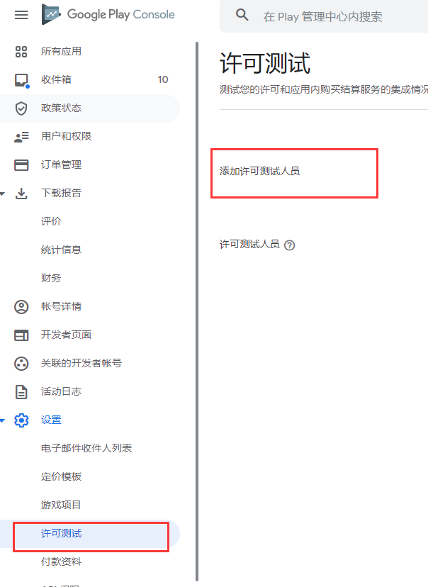

# Google Play上架支付信息配置篇

## 前期准备
- Postman网络请求工具
## Google Cloud服务端配置
### 1. 使用已经注册完成的 Google play 开发者账号登录[Google Play Console][1]，创建关联项目、启用Google Play Android Developer服务、并点击关联项目创建凭。
[1]:<https://play.google.com/console/developers> 

### 2、 添加凭据

**下载的json里面获取client_id、client_secret、redirect_uris**
### 3、 根据client_id获取Code
**直接用浏览器访问：https://accounts.google.com/o/oauth2/auth?scope=https://www.googleapis.com/auth/androidpublisher&response_type=code&access_type=offline&redirect_uri=https://sdkapi.yallagame.com/（替换项目的域名）&client_id=(项目的client_id)**
### 4、 根据client_id、client_secret、redirect_uris 和 code 获取refreshcode；一个凭据只能获取一次refreshcode
**Postman post提交：grant_type=authorization_code ；code= ； client_id= ； client_secret=  ； redirect_uri：**

### 5、 配置支付sku

### 6、 添加沙盒测试账号
