# Google Play上架签名文件配置篇（ Java 密钥库导出并上传密钥）

## 前期准备
- jdk环境变量
- [Play Encrypt Private Key (PEPK) 工具] [1] 
[1]:https://www.gstatic.com/play-apps-publisher-rapid/signing-tool/prod/pepk.jar
## 提审
### 一、创建app
#### 1. 使用已经注册完成的 Google play 开发者账号登录[Google Play Console][2]，应用名称、默认语言、应用或游戏、免费或付费根据证实情况填写。
[2]:<https://play.google.com/console/developers> 
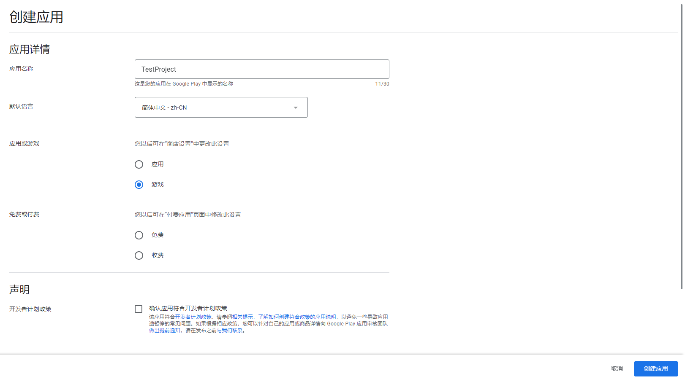
### 二、填写 app 信息
   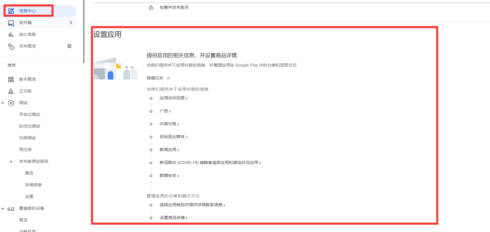
   **注：设置应用栏：应用访问权限、广告、 内容分级、 目标受众群体、 新闻应用、 新冠肺炎 (COVID-19) 接触者追踪应用和感染状况应用、 数据安全、 隐私权政策 全部必填项**
#### 1. 应用访问权限（根据实际情况填写即可）
---
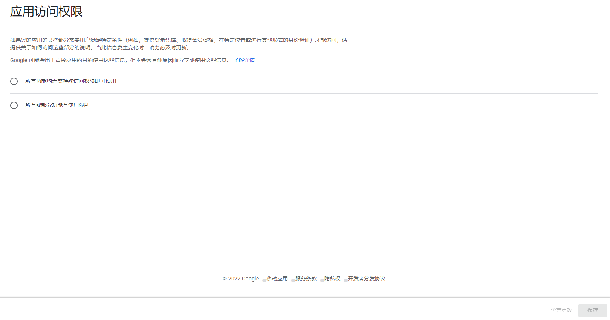
#### 2. 广告（根据实际情况填写即可）
---
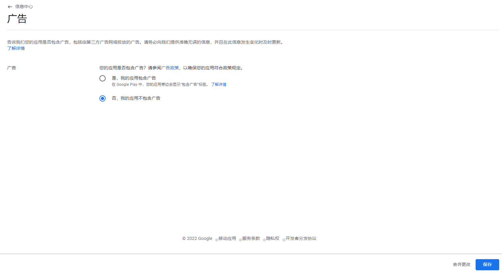
#### 3. 内容分级（根据实际情况填写即可）
---
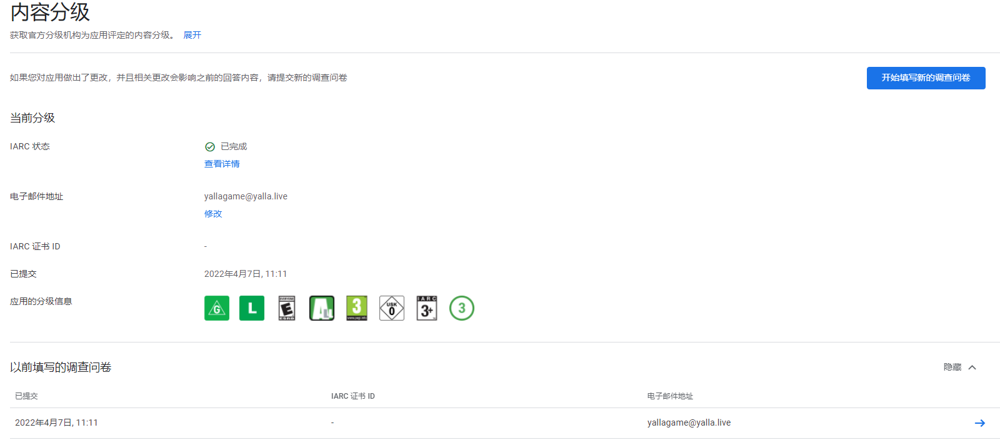
#### 4. 目标受众群体（根据实际情况填写即可）
---
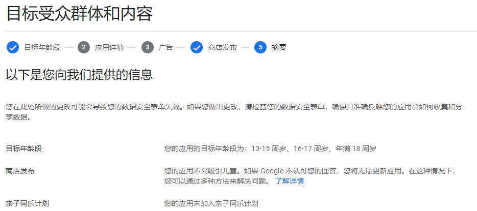
#### 5. 新闻应用（根据实际情况填写即可）                                              
---
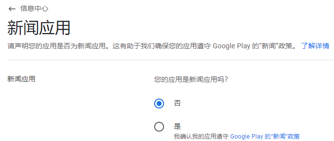
#### 6. 新冠肺炎 (COVID-19) 接触者追踪应用和感染状况应用（根据实际情况填写即可）
---
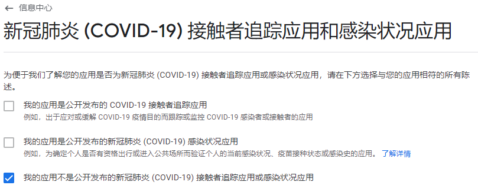
#### 7. 数据安全（根据实际情况填写即可，需要填写隐私协议地址）
---
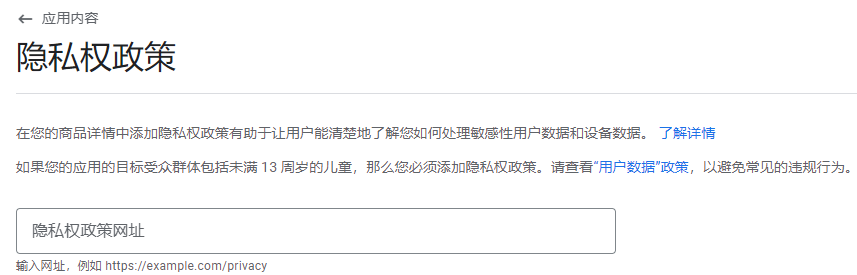
#### 8. 应用类别（根据实际情况填写即可）
---
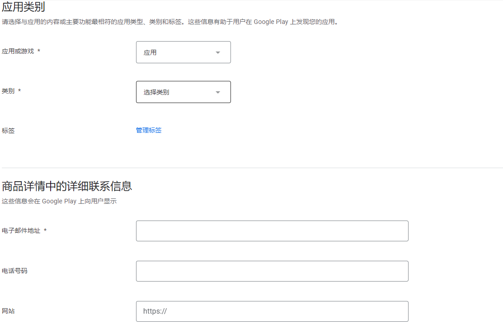
#### 9.主要商品详情（须注意：如果需要支持多语言的话、该处可以选择上传多个语言对应的信息）
---
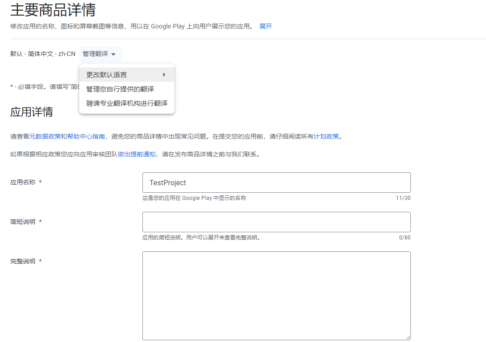