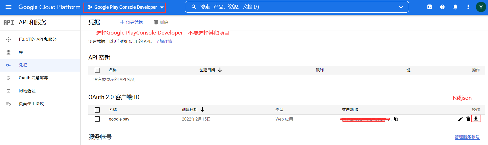
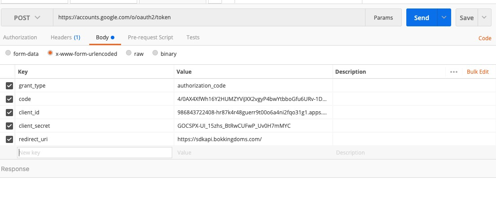
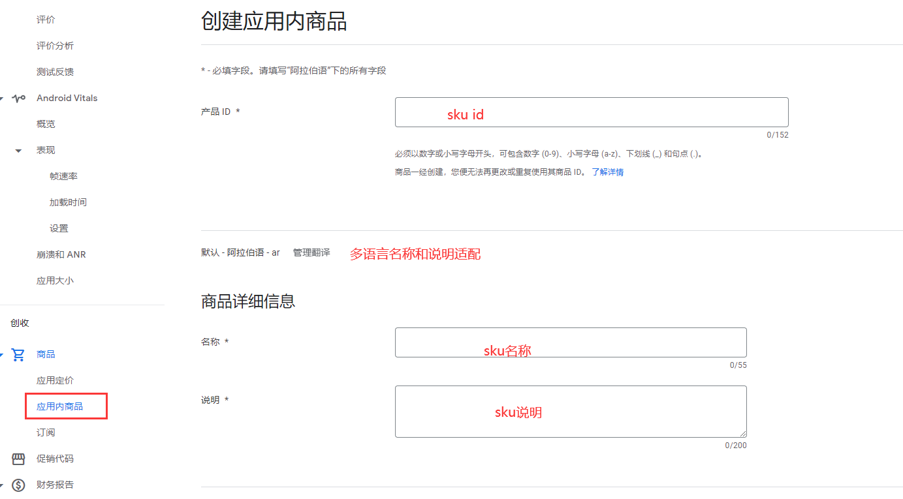
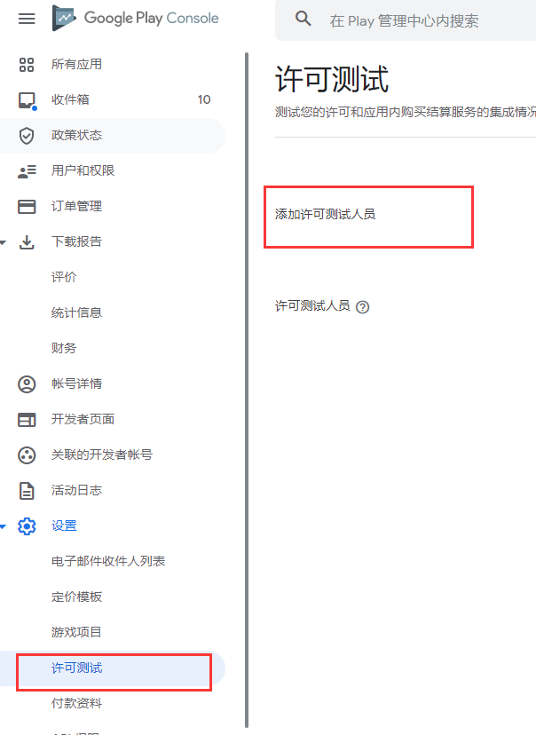

# Google Play上架签名文件配置篇（ Java 密钥库导出并上传密钥）

## 前期准备
- jdk环境变量
- Play Encrypt Private Key (PEPK) 工具(下载地址：https://www.gstatic.com/play-apps-publisher-rapid/signing-tool/prod/pepk.jar)
## AAB和签名文件提交
### 一、创建内部测试版本
**一般APP提审的流程为：内部测试-》封闭式测试-》开放式测试-》正式版发布。(AAB不允许大于150M)**
#### 1. 更改应用签名密钥（一般会使用自己的签名秘钥，如果更改默认使用谷歌的签名密钥。本文使用从 Java 密钥库导出并上传密钥）
---

#### 2. 从 Java 密钥库导出密钥
命令行：
---
    java -jar D:\Yalla\google_play_key\pepk.jar（pepk.jar存放的地址） --keystore=D:\AndroidStudioProject\yllgame\jks\yll_game_tech_mkw.jks（签名文件地址） --alias=ygt_mkw（签名文件别名） --output=D:\Yalla\google_play_key\ygt_mkw.zip（生成签名文件的路劲） --include-cert --encryptionkey=(encryptionkey)
---

#### 3. 添加测试用户
---
