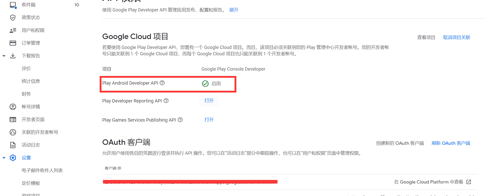

# Google Play上架签名文件配置篇（ Java 密钥库导出并上传密钥）

## 前期准备
- jdk环境变量
- Play Encrypt Private Key (PEPK) 工具(下载地址：https://www.gstatic.com/play-apps-publisher-rapid/signing-tool/prod/pepk.jar)
## AAB和签名文件提交
### 一、创建内部测试版本
**一般APP提审的流程为：内部测试-》封闭式测试-》开放式测试-》正式版发布。**
#### 1. 更改应用签名密钥（一般会使用自己的签名秘钥，如果更改默认使用谷歌的签名密钥）
---

#### 3. 内容分级（根据实际情况填写即可）
---

#### 4. 目标受众群体（根据实际情况填写即可）
---

#### 5. 新闻应用（根据实际情况填写即可）                                              
---

#### 6. 新冠肺炎 (COVID-19) 接触者追踪应用和感染状况应用（根据实际情况填写即可）
---

#### 7. 数据安全（根据实际情况填写即可，需要填写隐私协议地址）
---

#### 8. 应用类别（根据实际情况填写即可）
---

#### 9.主要商品详情（须注意：如果需要支持多语言的话、该处可以选择上传多个语言对应的信息）
---
